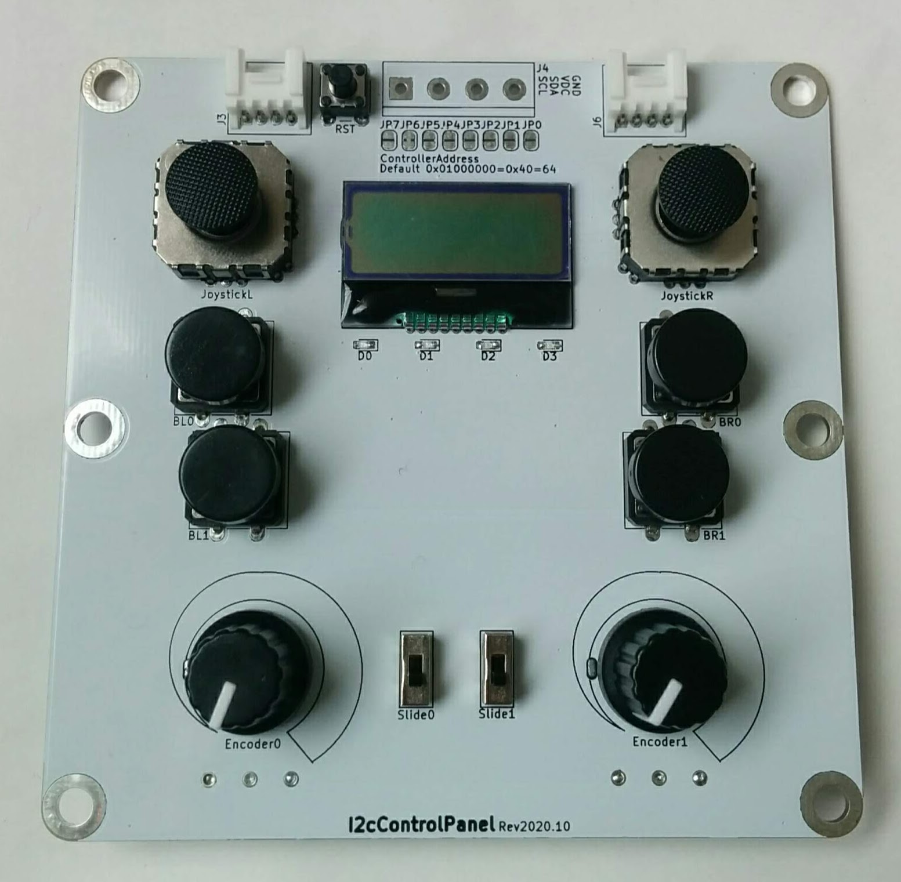

# I2cControlPanel

A wired control panel.

# Where to buy

- [I2cControlPanel | スイッチサイエンス](https://www.switch-science.com/catalog/6824/)

# Components

- [Joystick](https://ja.aliexpress.com/item/4000540937190.html)
- [Joystick cap](https://ja.aliexpress.com/item/33035062962.html)
- [Encoder](https://ja.aliexpress.com/item/32783863247.html)
- [Switch](https://akizukidenshi.com/catalog/g/gP-09826/)
- [LCD 8x2](https://akizukidenshi.com/catalog/g/gP-06669/)
- [Slide switch](https://akizukidenshi.com/catalog/g/gP-12723/)
- [3V3 regulator](https://akizukidenshi.com/catalog/g/gI-10675/)
- [LED 0603](https://akizukidenshi.com/catalog/g/gI-06417/)
- [0.47f 0402](https://akizukidenshi.com/catalog/g/gP-07504/)
- [0.01f 0603](https://akizukidenshi.com/catalog/g/gP-13387/)
- 0.1uf 0603
- [Diode](https://akizukidenshi.com/catalog/g/gI-06467/)
- 10k 0603

# License

MIT

# References

- [エンコーダー（可変抵抗）が付いた有線コントローラーを作ってみた](https://asukiaaa.blogspot.com/2020/11/i2c-control-panel.html)
- [WiredController](https://github.com/asukiaaa/WiredControllerPcb)
